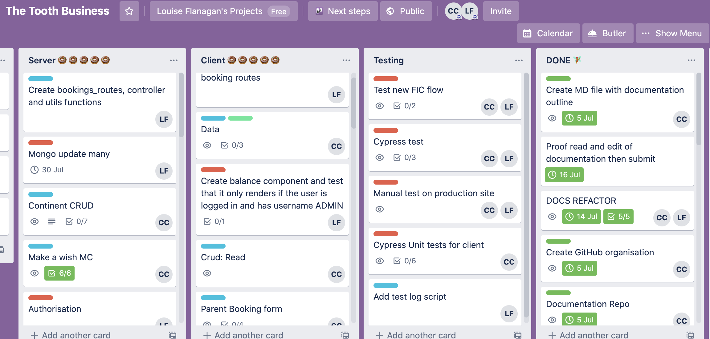
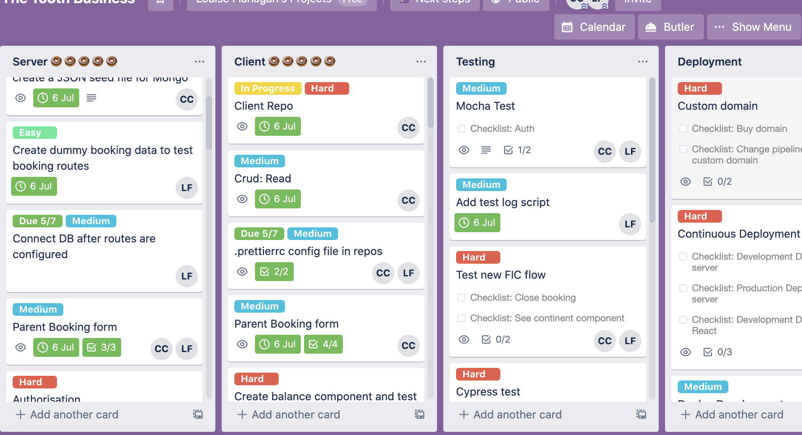
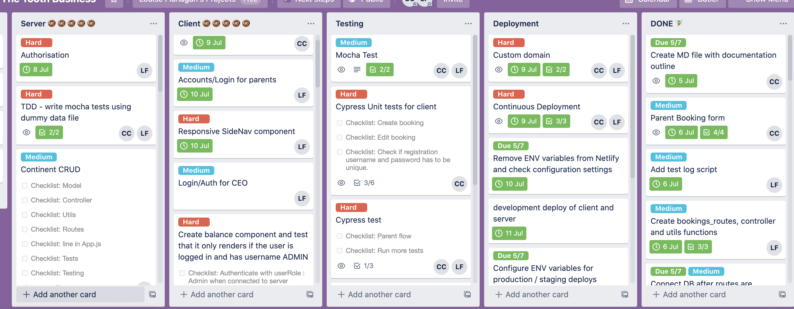
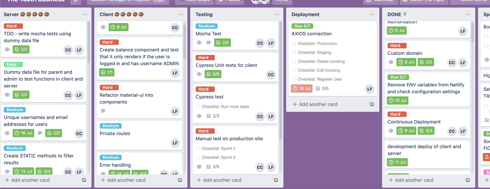
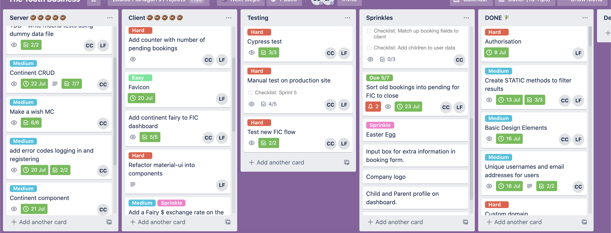
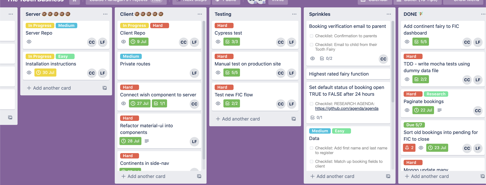
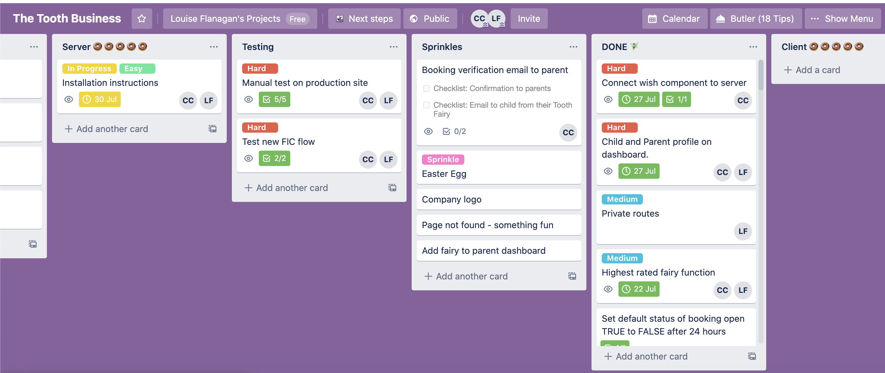

# 🦷 Tooth Inc. MERN application

### Louise Flanagan & Catherine Callcott-Stevens

 

---

💎 Deployed App: https://www.toothinc.online/
🛠 Staging Environment App: https://www.development.toothinc.online/
🖥 Client Repo: https://github.com/The-Tooth-Business/client
🖥 Server Repo: https://github.com/The-Tooth-Business/server
📖 Part A Documentation Repo: https://github.com/The-Tooth-Business/TheToothFairyDocs

ToothInc.online is a comprehensive booking management system for the Tooth Fairy and a place for parents to book tooth collections. The application has been built with the MERN stack and deployed with Netlify and Heroku.

## Installation Instructions

To use the production app, please visit toothinc.online and create an account.
To use the app locally, please follow the below instructions.

Requirements:

- Node.js
- MongoDB. If you do not have MongoDB installed, please follow the installation instructions here (https://docs.mongodb.com/guides/server/install/) and make sure that Mongo is running locally.

Server:

- Create a directory on your machine named ToothInc and CD into it.
- Whilst in the ToothInc directory, from bash CLI, clone the server repo `$ git clone https://github.com/The-Tooth-Business/server.git`
- CD into the server folder `$ CD server`
- Install npm packages with `$ npm install`
- Make sure that Mongo is running.
- Seed the Mongo database with the following command `$ npm run seed` to view dummy data in your local application
- From bash, `npm start` to start the local server
- The server will run on local host 3030

Client:

- From bash, cd into the ToothInc directory and clone the client repo `$ git clone https://github.com/The-Tooth-Business/client.git`
- Move into the client folder `$ CD client`
- Install npm packages with `$ npm install` or `$ yarn install`
- Make sure that your local server is running.
- From bash, `$ npm start` or `$ yarn start` to start the local client
- The server will allow requests from local host 3000
- A browser window will open - this app has been developed and tested with Google Chrome.
- Enjoy :)

To view as admin:

- The seed data file created an admin account for you with the following credentials to login:
  username: FIC
  password: 123456

To view as a parent:

- The seed data file setup the below parent account with dummy data however you can now also create an account as a new user would.
  username: user1
  password: 123456

---

## API Endpoints

### Authentication:

- POST /auth/register
- POST /auth/login
- GET /auth/logout

### Bookings

- GET /bookings/
- GET /bookings/continent
- GET /bookings/:id
- POST /bookings
- DELETE /bookings/:id
- PATCH /bookings/:id

### Continents

- GET /continents/
- GET /continents/continent
- POST /continents
- DELETE /continents/:id
- PATCH /continents/:id

### Wishes

- GET /wishes/
- GET /wishes/:id
- POST /wishes
- DELETE /wishes/:id
- PATCH /wishes/:id

### Testing

The application has been tested in Chrome on Mac OS Catalina 10.15.6.

The production and development applications have both gone through extensive automated and manual testing with Postman, Mocha and Cypress.

Manual test logs:
Cypress Dashboard logs:

### Server Libraries & Dependencies:

- `express ^4.17.1` -
- `mongoose ^5.9.22` - Mongoose is an Object Data Modelling (ODM) library for MongoDB and Node.js. It allows the creation of strongly-typed schemas for MongoDB documents to provide data validation. Several models have been defined within the server containing Mongoose schemas to better structure and validate database documents.
- `mongoose-Seed ^0.6.0` - Used to create a seed script to seed the local database with default data.
- `mongoose-unique-validator` - A plugin which adds pre-save validation for unique fields within a Mongoose schema. This is used to add an extra layer of validation when new users create accounts.
- `express-session ^1.17.1` - Creates user sessions and stores the session data on the server and gives the client a session ID to access the data.
- `connect-mongo ^3.2.0` - Allows for user sessions created with express-session to be saved in the Mongo database. It automatically removes expired sessions based on the lifespan of the session set in app.js.
- `cors ^2.8.5` - CORS is a node.js package for middleware that enables cross origin resource sharing between the Express server and React client.
- `passport, passport-local and passport-local-mongoose` -
- `dotenv ^8.2.0` - Dotenv is a zero-dependency module that loads environment variables from a .env file into process.env. Env variables have been used to safely store information such as database keys and to conditionally determine which version of the client to connect with.
- `body-parser ^1.19.0` - Body parser extracts the entire body of an incoming request and exposes it on req.body. The body of incoming request objects contains information from the client to access the database and is used in the server for authentication.

#### Server Development dependencies

- `mocha ^8.0.1` - Testing framework used to unit test the different api endpoints within the server.
- `expect ^26.1.0` - as a dependency of mocha
- `nodemon ^2.0.4` -
- `prettier ^2.0.5` - Used to declare a pre-defined code format to maintain consistency across different developer machines.

### Client Libraries & Dependencies:

- `react ^16.13.1`: A Javascript Front-end library for building user interfaces. Maintained by Facebook.
- `react-dom ^16.13.1` -
- `react-router-dom ^5.2.0` -
- `react-scripts 3.4.1` -
- `react-simple-maps ^2.1.2` - Used to create the interactive map of bookings by country in the user dashboard.
- `react-tooltip ^4.2.7` - Used as a dependency to react-simple-maps, this package is used to create tooltips that appear over countries when they are hovered over on the interactive map.
- `material UI core & icons` - Material UI is a
- `axios` - Axios is a Javascript library used to make HTTP requests to the server from the client. Axios configuration has been set in src/config/api.js to use environment variables via `process.env`. Bookings, auth and fairy services each use axios to make HTTP requests to their dedicated api end points on the server.
- `chart.js` - A JavaScript library that provides simple and flexible charting. Chart.js was used to create the animated doughnut diagram displaying bookings by continent on the admin dashboard.
- `env-cmd ^10.1.0` -
- `moment ^2.27.0` -

#### Client Development dependencies

- `cypress ^4.10.0` -
- `eslint-plugin-cypress ^2.11.1` - An additional linter specifically for Cypress testing. Without this linter, VS Code does not recognise some of the Cypress functions as declared.
- `prettier ^2.0.5` - Used to declare a pre-defined code format to maintain consistency across different developer machines.

### Project management

In phase one of this project we undertook extensive market research and planning from briefs given to us by the client. We finished what would be the first sprint with the green-light to run with the project. A sprint review at the end of sprint one had most of the documentation completed

We had done our preliminary sprint planning where we had added the most obvious tasks to the Trello, but at our agile ceremony we got out the user stories to effectively project manage. As we read through each user story we discussed which tasks the story gave us. When we reached a consensus we would add the cards to the Trello. We also discussed which tasks were the most important to complete first and started planning our sprints accordingly. We are a very effective agile team and agreed immediately on an effort estimation of getting as much done in the first two sprints as we could as our experience suggested the client would add new features as the project progressed. 

This was the longest ceremony and it helped us build a plan, using the Trello board, with a comprehensive lists of tasks. The tasks were all given a due-date based on which sprint they were in, and a rating of easy, medium and hard. Tasks for the first sprint were given an agile estimate and then were allocated fairly. We were going to use planning poker, but it was quite hard in a team of two and we were pretty much in agreement about how long each task would take.

We decided on 5 day sprints and started each day at 9am with a stand-up on Discord. At the stand-up we discussed how we went the day previously and talked through any blockers. We planned more difficult tasks to fall on the days that we could pair-programme. At the end of each sprint we checked that we had completed all the tasks assigned on the Trello for the sprint and marked them as done or pushed them into sprint backlog. This really only happened between Sprint 4 and 5 when the FIC(Fairy in Charge) added new features and they were more complex than expected.

 As previously stated, all tasks were colour coded for difficulty - green tag for easy, blue tag for medium, red tag for hard. Most jobs fell into the medium category but we tried to equally share the hard jobs or pair-programmed them. We really wanted to solidify our skills, so neither of us were trying to avoid the tough jobs! We split the server and React set-up into front and back-end to quickly get to a point of deploying and connecting the two. Therefore for the first sprint Louise was mostly only working in the server and Catherine was working in React. However, as soon as we had deployed we took on tasks in both back and front-end. 

#### Sprint 1

We worked extra hard in the first two sprints and set up Front and Backend Frameworks with CRUD functionality and Mongo. All functions were manually tested until they were operating as expected. During this time we had some issues with finding our 'Git Flow', but by the end of sprint 1 we were confidently using forking flow. No other blockers during this sprint.

##### User Stories addressed

3. As the parent in a chaotic family, we have been known to lose the occasional tooth before the tooth fairy can collect it. In these cases it is reassuring to know that I can login to my personal portal and cancel a tooth collection.

4. As a parent of twins my boys do everything together, sometimes even lose teeth. I need to be able to update my pick-up order from one to two or more teeth.

##### Trello at the start of Sprint 1

The-Tooth-Business/client pull requests #1-#18 
The-Tooth-Business/server pull request #1-10

### Sprint 2
Sprint 2 was all about Login Functionality (authorisation) on both the front and back end and deployment. We believe in deployiong early and often. We set up a CI/CD pipeline so that each time we did a Pull Request in Github our site was deployed in a development environment. At the end of each sprint we merged our development branch to master which deployed to our production branch. This was tricky, but very worthwile as we always know our production code is working even if we temporarily break our development app. We also ran working Mocha and unit tests on the booking component and started Cypress testing. Cypress testing slowed us down somewhat because we didn't have any experience, but we got there in the end and now find it so useful.

We also addressed the FIC's concerns about site security. She keeps a lot of sensitive data and was worried about being hacked, so we outsourced the site security to Santa's elves who are 'red hat' hackers.

##### User Stories addressed

1. As a busy parent I need to organise a Tooth Fairy pick up quickly and easily. Being able to login to a portal where all my details are saved saves me a lot of time.

7. As the Fairy In Charge, the most important thing for me is that my online portal is secure to protect the Top Secret Secret about what I do with all of the teeth.

##### Trello at the start of Sprint 2

The-Tooth-Business/client pull requests #18-#29 
The-Tooth-Business/server pull request #11-15

#### Sprint 3 

We started adding some basic Material-ui components to design the front-end of the app. Built the framework for a dashboard for the FIC. After UI testing we decided to improve the booking form by adding a currency and continent drop down, and redesigned it. Created a 'success' capability so that parents can easily see if their booking has been accepted. Started working on our very important side-nav component, added Fairy $ exchange and added more Cypress tests. Finally we bought a custom domain and deployed to it. Catherine had some trouble setting up pagination in the server but as the team are using Material-ui they found an easier way of using it for pagination in React. 

##### User Stories addressed

2. As a parent of an anxious child I need the peace of mind that when I book the Tooth Fairy there will definitely be a pick-up that same night. My child would be so disappointed to find the tooth still under her pillow in the morning, so I need to receive confirmation that my booking has been successful.

6. As the Fairy in Charge (FIC) of Tooth Inc, an online dashboard is imperative to the successful running of one of the biggest organizations in Fairyland.

10. As the Fairy In Charge at Tooth Inc, fiscal responsibility is a huge part of my job. Having a place where I can see with a glance how the organisation is positioned makes it easier for me to focus on what is really important.

Second Consult 2. As the FIC I operate in all the major currencies and need my dashboard to give me the daily Fairy $ exchange rate which is based on an amalgamation of the biggest currencies.

##### Trello at the start of Sprint 3

The-Tooth-Business/client pull requests #29-#38 
The-Tooth-Business/server pull request #16-19

#### Sprint 4

After another consultation with the FIC, she has decided that she wants to view each Continent Manager in a Fairy profile. This will render the managers' rating; work ID photo; short bio and all their bookings. We made her Fairyness understand that at this late stage of the project resources would have to be pulled from elsewhere, so she decided that she could live without email confirmation and we added this new component to sprint 4. She also mentioned that she was becoming overwhelmed with the number of wishes she recieved so we agred to build a wish component into the app. This turned out harder than expected and caused a short blocker. We also finished the rating component which had been planned for this sprint.

##### User Stories addressed

5. As a parent that wants only the best for my child I need to be able to rate and review the service I have received from the Tooth Fairy.

8. As the Fairy In Charge I am personally responsible for collecting and 'taking care of' the lost baby teeth of every single child on Earth and I need a responsive environment to manage all of the bookings.

9. As the Fairy In Charge I need all of the daily tooth pick-ups to be automatically collated into an order summary report for the manager of each continent.

11. As the Fairy in Charge I need to easily see how each continents' manager is rating so I can quickly take steps to maintain my good reputation.

Second Consult - 3. As the FIC I am a very visual person so I would like charts on my dashboard so I can easily understand the displayed data.

Third Consult - 1 As the FIC I would like to see each continent manager, remember who they are (I am 3562 years old!) and see their bookings and ratings.

Third Consult - 2 As the FIC I would love to recieve wishes one by one with a button I can click to grant them or not (and not have to explain my reasoning!)

##### Trello at the start of Sprint 4

The-Tooth-Business/client pull requests #38-#48 
The-Tooth-Business/server pull request #20-26

#### Sprint 5

 At our Sprint 4 review we discussed our sprint backlog because we hadn't finished the wish and continent components. We agreed to do some pair programming to push these tasks out quickly and then focused on some 'sprinkle' design elements.

##### User Stories addressed

Still working on third consult user stories from Sprint 4. 

##### Trello at the start of Sprint 5

The-Tooth-Business/client pull requests #49-#63
The-Tooth-Business/server pull request #27-32

#### Final Sprint

By the final sprint most coding was complete so we had 4 days to refactor code to make it drier, add some design sprinkles and work on docs. Two of the sprinkles were a Captcha to check if the person logging on is actually an adult, and an image on the login page.

##### User Stories addressed

Refactoring to make code dry. Docs. Sprinkles - Image component on login page, auth check for age, more design elements. seed file for db and runfile

The-Tooth-Business/client pull requests #63-#
The-Tooth-Business/server pull request #33-35

### Retrospective

Louise and Catherine are so proud of this project. They have not only worked very hard to get it done to the quality they expect of themselves, but they made the FIC happy. They have at at all times worked as a team and pulled the other through on the odd occassion that things got tough. The only thing they are dissapointed about not getting done is the email functionality, but it was a decision of the client to let it go in favour of some other components that the team is very happy with.

